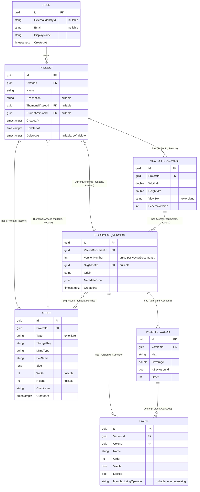

# IMPL.md — M2.2-S02 · Modelo de datos y ERD del dominio

Implementación del modelo persistente de dominio (`User`, `Project`, `Asset`,
`VectorDocument`, `DocumentVersion`, `Layer`, `PaletteColor`) agregado al mismo
`VectorizationDbContext` introducido por M2.2-S01. **No conecta nada a la aplicación
real** (ningún endpoint, repositorio ni query real) — eso es M2.2-S03. Ningún registry
de archivos JSON existente (`PersistentProjectRegistry`,
`PersistentLayerLayoutVersionRegistry`, etc.) fue tocado.

## ERD (Mermaid)



Diagrama reflejando el modelo FINAL tal como terminó implementado (migración
`AddDomainEntities`, ver `backend/Vectorify.Api/Migrations/20261001162400_AddDomainEntities.cs`).

## ADR — Normalización vs JSONB vs Asset

### Contexto

El modelo necesita persistir, para cada versión de un documento vectorial: su paleta de
colores, sus capas (layers), metadata de la última vectorización, y el SVG resultante en
sí. La tarjeta pide explícitamente justificar qué se normaliza como tabla relacional, qué
se guarda como JSONB, y qué se guarda como asset/blob referenciado — ambas decisiones
conviven en el mismo modelo.

### Decisión 1 — `Layer` y `PaletteColor` SÍ se normalizan como tablas propias

**Por qué:** ambos tienen necesidades de acceso que JSONB no resuelve bien:

- Se consultan/filtran por `VersionId` de forma independiente (ej. "dame las capas
  visibles de esta versión", "dame el color de fondo") — índices relacionales
  (`IX_layers_VersionId`, `IX_palette_colors_VersionId`) resuelven esto directamente;
  filtrar dentro de un array JSONB requeriría expresiones JSON path en cada query.
- `Layer.ColorId → PaletteColor.Id` es una relación real entre dos colecciones
  (una capa referencia un color de la paleta) — modelarla dentro de JSONB forzaría
  duplicar el color en cada capa o mantener manualmente la integridad referencial
  que Postgres ya garantiza gratis con una FK.
- Tienen un ciclo de vida de escritura incremental (reordenar capas, togglear
  visibilidad/lock, reasignar operación de fabricación) — mutar una fila es más
  barato y más seguro de razonar que reescribir un documento JSONB completo cada vez
  (riesgo de condiciones de carrera al actualizar un array JSONB entero).
- Ya existe evidencia concreta en el código de que esto se consulta así: los sidecars
  actuales (`LayerLayoutSetVersion`, `ManufacturingOperationAssignment`) son,
  conceptualmente, exactamente esto — una fila por capa con sus propios campos.

**Costo aceptado:** más tablas, más joins para reconstruir una versión completa. Se
acepta porque el caso de uso dominante (Workspace editando capas/paleta) es de lectura y
escritura granular, no "leer/escribir el documento entero como un blob".

### Decisión 2 — La geometría SVG NO se normaliza

**Por qué:** el contenido de un `<path d="...">` (nodos, puntos, curvas) no tiene ningún
caso de uso de query relacional — nunca se filtra "dame todos los puntos con X
coordenada", se lee/escribe siempre como el documento completo. Normalizarlo en tablas de
nodos/puntos:

- Multiplicaría el volumen de filas por varios órdenes de magnitud sin ningún beneficio
  de consulta.
- Perdería exactamente la semántica por la que el SVG es SVG (orden de los comandos de
  path, curvas Bézier, etc.) — reconstruir el string original desde filas normalizadas es
  trabajo extra sin payoff.
- Está explícitamente prohibido por la tarjeta ("no crear tablas de nodos/puntos salvo
  evidencia") y no hay evidencia de ningún caso de uso que lo requiera.

En su lugar, `DocumentVersion.SvgAssetId` referencia un `Asset` (vía `StorageKey`) — el
archivo SVG completo vive como blob/snapshot fuera de la base relacional (el storage real
de esos blobs es responsabilidad de M2.2-S04; esta tarjeta solo deja la columna
preparada). La metadata *sobre* esa geometría (dimensiones, viewBox, cuántas versiones
tiene un documento) sí es consultable en DB porque esa metadata sí tiene casos de uso de
query reales (listar proyectos, listar versiones).

### Decisión 3 — Criterio de corte general

El corte no es "todo lo de dominio se normaliza, todo lo externo es blob": es **¿esto se
consulta/filtra/relaciona con otras filas, o se lee/escribe siempre como una unidad
opaca?**

- Se consulta/filtra/relaciona → tabla propia con FK e índices (`Layer`, `PaletteColor`,
  y las entidades "raíz" `User`/`Project`/`Asset`/`VectorDocument`/`DocumentVersion`).
- Se lee/escribe como unidad opaca, heterogénea o evolutiva, sin necesidad de columnas
  propias todavía → JSONB (`DocumentVersion.MetadataJson`: parámetros de la última
  vectorización, datos que cambian de forma entre versiones del pipeline de Python, no
  amerita una migración de esquema por cada campo nuevo).
- Se lee/escribe como unidad opaca y es fundamentalmente un archivo binario/texto grande
  sin estructura consultable → asset/blob referenciado por `StorageKey`
  (`DocumentVersion.SvgAssetId`, el SVG canónico en sí).

`VectorDocument.ViewBox` es la excepción aparente: es "solo" un string
(`"0 0 800 600"`), pero se mantiene como columna de texto plana, NO JSONB — es un valor
atómico simple, parsearlo desde JSONB no aportaría nada sobre una columna `text`
directa, y JSONB se reserva para estructuras genuinamente heterogéneas.

## DeleteBehavior por relación (evitar ciclos de cascada)

El spec señala explícitamente el riesgo de ciclo: `Project.ThumbnailAssetId → Asset.Id`
y `Project.CurrentVersionId → DocumentVersion.Id` apuntan "hacia adentro" del agregado,
mientras que `Asset.ProjectId → Project.Id` y la cadena
`DocumentVersion.VectorDocumentId → VectorDocument.Id → Project.Id` apuntan "hacia
afuera". Criterio adoptado:

| Relación | DeleteBehavior | Razón |
|---|---|---|
| `Project.OwnerId → User.Id` | **Restrict** | No existe flujo de borrado de `User` en esta tarjeta (fuera de alcance explícito: auth real es M2.2-S09); Restrict evita que un hard delete de `User` cascadee silenciosamente sobre todos sus proyectos. |
| `Asset.ProjectId → Project.Id` | **Restrict** | Evita el ciclo con `Project.ThumbnailAssetId → Asset.Id`. Como `Project` usa soft delete (`DeletedAt`) como mecanismo primario de borrado, un hard delete de `Project` no es un flujo soportado todavía por esta tarjeta (ningún repositorio/endpoint de borrado real existe aún — eso lo define la tarjeta que lo necesite). |
| `VectorDocument.ProjectId → Project.Id` | **Restrict** | Mismo criterio que `Asset.ProjectId`: evita el ciclo con `Project.CurrentVersionId → DocumentVersion.Id`. |
| `Project.ThumbnailAssetId → Asset.Id` (nullable) | **Restrict** | No se puede borrar un `Asset` que sigue siendo el thumbnail de un proyecto sin limpiar el puntero primero — previene pérdida silenciosa de la referencia. |
| `Project.CurrentVersionId → DocumentVersion.Id` (nullable) | **Restrict** | Mismo criterio que `ThumbnailAssetId`: protege contra borrar la versión "actual" de un proyecto sin querer. |
| `VectorDocument.Id ← DocumentVersion.VectorDocumentId` | **Cascade** | `DocumentVersion` es un hijo propio de `VectorDocument`, sin otra entidad externa apuntándole salvo `Project.CurrentVersionId` (que es Restrict) — si una versión es la "actual" de algún proyecto, Postgres rechaza el cascade delete del `VectorDocument` padre (protección real en runtime, no solo documentada). |
| `DocumentVersion.SvgAssetId → Asset.Id` (nullable) | **Restrict** | Preserva integridad de snapshots históricos: no se puede borrar el `Asset` que es el SVG canónico de una versión sin limpiar el puntero primero. |
| `DocumentVersion.Id ← Layer.VersionId` | **Cascade** | `Layer` es un hijo propio de `DocumentVersion`, nada más lo referencia. |
| `DocumentVersion.Id ← PaletteColor.VersionId` | **Cascade** | Mismo criterio que `Layer`. |
| `PaletteColor.Id ← Layer.ColorId` | **Cascade** | `Layer.ColorId` es un componente propio de la paleta de esa versión. Junto con `Layer.VersionId` (también Cascade) arma un "diamante" de cascada hacia `layers` (vía `document_versions` directo y vía `palette_colors`) — PostgreSQL soporta múltiples rutas de cascada hacia la misma tabla sin problema (a diferencia de SQL Server, que lo restringe). |

**Resumen del criterio:** las relaciones "raíz → agregado propio sin referencias
externas" (`VectorDocument→DocumentVersion`, `DocumentVersion→Layer/PaletteColor`,
`PaletteColor→Layer`) usan **Cascade**. Cualquier relación que participe en el ciclo
`Project↔Asset`/`Project↔DocumentVersion`, o que apunte a un `Asset`/`DocumentVersion`
que podría ser una referencia "puntero" activa desde otro lado, usa **Restrict** —
prioriza seguridad ante pérdida de datos por sobre conveniencia de borrado en cascada,
consistente con que `Project` ya usa soft delete como mecanismo primario de "borrado" en
el flujo de aplicación.

## Ambigüedades del spec — decisiones tomadas

- **Formato del ERD**: Mermaid `erDiagram` embebido en este `.md` (recomendación del
  orquestador adoptada tal cual) — versionable como texto, se renderiza nativo en
  GitHub/Notion.
- **`ViewBox` vs `MetadataJson`**: `ViewBox` como columna `text` plana;
  `MetadataJson` de `DocumentVersion` como `jsonb` real (Npgsql lo soporta nativamente,
  columna `.HasColumnType("jsonb")`) — recomendación del orquestador adoptada tal cual,
  ver ADR Decisión 3.
- **Soft delete automático**: se adoptó el global query filter de EF Core
  (`entity.HasQueryFilter(e => e.DeletedAt == null)` en `Project`, configurado en
  `VectorizationDbContext.OnModelCreating`) — cualquier query futura contra `Projects`
  excluye por defecto los proyectos borrados. `.IgnoreQueryFilters()` está disponible
  explícitamente para los casos (si los hay) que sí necesiten verlos — cubierto por el
  test `Project_SoftDeleted_IsExcludedByDefault_ButVisibleWithIgnoreQueryFilters`.
- **Ciclo `Project.CurrentVersionId`/`Asset.ProjectId`/etc.**: resuelto con la tabla de
  DeleteBehavior de arriba — Restrict en toda relación que participa del ciclo, Cascade
  solo en relaciones "hacia adentro" del agregado sin referencias externas.
- **`PaletteColor` RGB**: NO se descompone en columnas `R`/`G`/`B` separadas — se guarda
  únicamente `Hex`. Mismo criterio que `ColorGroup.ColorHex` (el tipo equivalente ya
  existente en el código, que tampoco descompone el color): R/G/B serían datos
  derivados redundantes del mismo Hex, sin un caso de uso de query que hoy los necesite
  como columnas propias.
- **`Asset.Type`**: texto libre (`string`), no un enum cerrado — esta tarjeta no tiene
  evidencia suficiente para fijar de antemano el conjunto final de tipos de asset
  (imagen fuente subida, snapshot SVG, thumbnail, etc.); fijarlo prematuramente como
  enum forzaría una migración de esquema en cuanto aparezca un tipo nuevo.
- **`Project.Description`**: nullable (`string?`) — la tarjeta no lo marca como
  obligatorio en "Entidades mínimas" y no todo proyecto necesita descripción.
- **`Layer.ManufacturingOperation`**: reutiliza el enum YA EXISTENTE
  `Vectorify.Api.ManufacturingOperations.ManufacturingOperationKind` (Cut/Engrave/
  Ignore), persistido como texto (`HasConversion<string>()`), nullable — `null`
  significa "sin asignar", mismo criterio que la ausencia de un
  `ManufacturingOperationAssignment` hoy (nunca asumir "Corte" por defecto).
- **Generación de `Guid` Id**: se deja el comportamiento default de EF Core para claves
  `Guid` (generación client-side en `SaveChanges`, sin `uuid_generate`/`gen_random_uuid`
  del lado de Postgres) — consistente con que el resto del proyecto genera sus Guid en
  código C#, no en la base.
- **Nombres de tabla/columna**: tablas en `snake_case` (`users`, `projects`, `assets`,
  `vector_documents`, `document_versions`, `layers`, `palette_colors`), columnas en
  PascalCase sin mapeo explícito — mismo patrón EXACTO que `schema_probes` de M2.2-S01
  (tabla snake_case, columnas `Id`/`CreatedAt` sin renombrar).

## Verificación (resultados reales)

### 1. `dotnet build` (backend/)

```
Vectorify.Api -> .../backend/Vectorify.Api/bin/Debug/net9.0/Vectorify.Api.dll
Vectorify.Api.Tests -> .../backend/Vectorify.Api.Tests/bin/Debug/net9.0/Vectorify.Api.Tests.dll

Compilación correcta.
    0 Advertencia(s)
    0 Errores
```

### 2. `dotnet test` (backend/)

Corrido contra PostgreSQL real vía Testcontainers (requiere Docker; incluye los tests
nuevos de M2.2-S02, cada uno con su propio contenedor efímero — más lento por diseño,
esperado por el spec):

```
Correctas! - Con error:     0, Superado:   677, Omitido:     0, Total:   677, Duración: 3 m 22 s - Vectorify.Api.Tests.dll (net9.0)
```

### 3. `pytest` (services/python-engine/, .venv activo)

No se tocó ningún archivo de `services/python-engine/`:

```
400 passed, 1 warning in 8.07s
```

### 4. `npm test -- --run` (frontend/)

No se tocó ningún archivo de `frontend/`. Primera corrida: 1 test flaky
(`EditorShell.test.tsx`, timeout por contención de recursos al correr junto al resto de
la suite — jsdom recreado 36 veces) falló; reproducido en aislamiento (pasó en 3.2s) y en
una segunda corrida completa de la suite (pasó limpio) — confirmado no relacionado con
esta tarjeta, que no tocó ningún archivo de frontend:

```
Test Files  36 passed (36)
     Tests  307 passed (307)
```

### 5. `npm run build` (frontend/)

No se tocó ningún archivo de `frontend/`:

```
✓ 180 modules transformed.
✓ built in 394ms
```

(0 errores; un warning preexistente de tamaño de chunk, no relacionado con esta tarjeta.)
